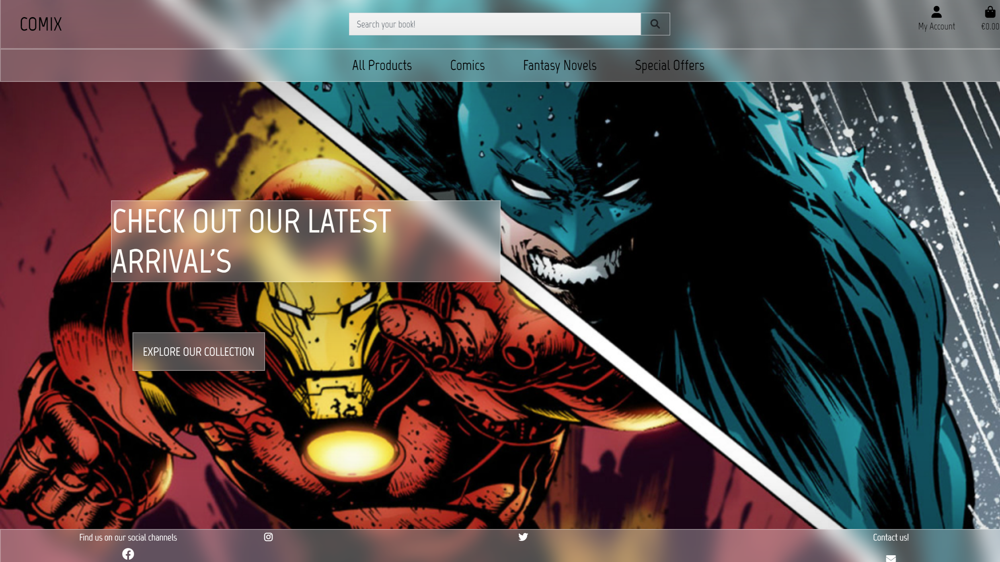

# Comix


Comix is a e-commerce website for fantasy novels and comic books. Users can register to the website for discounts, leave reviews and purchase their comics or books.
This is the 4th and final project created for code institute Full stack developer program.

A live version of the website can be found [here](https://thijsterporten-milestone-4.herokuapp.com/)

**For testing purposes, please use the following credit card details:**

`Card number:` 4242 4242 4242 4242
`Exp:` any date in the future using MM/YY format
`CSV:` any 3 numbers, ie 424

## **CONTENTS**

- [UX](#ux)
  - [User Experience](#user-experience)
  - [User Stories](#user-stories)
  - [Owner](#owner)
  - [First Time User](#first-time-user)
  - [Registered User](#registered-user)
- [Design](#design)
  - [Color Scheme](#color-scheme)


## User Experience(UX)

The site owner's primary goals of the website are:

1. Selling books to new and returning customers.
2. Showcase products that are new to new and returning customers.

### User Stories

#### Owner

- As a owner of the application I would like to provide my users with an incentive to register to the website.
- As a owner of the application I would like to let my users have a nice intuitive process throughout the app.
- As a owner of the application I would like my products to be displayed in an attractive manner.
- As a owner of the application I have to be able to manage all my products.
- As a owner of the application I would like to be able to recieve customer feedback.
- As a owner I would like to be able to remove reviews that aren't related to the product.

#### First Time User

- As a first time user I would like to instantly see what the website is about.
- As a first time user I would like to easily navigate through all available products.
- As a first time user I would like to have a clear description about each product.
- As a first time user I would like to be able to sort products based on rating, price etc.
- As a first time user I would like to search the site for a specific product.
- As a first time user I would like to have an incentive to register to the app.
- As a first time user I would like to see what products are on offer or on a special sale.
- As a first time user I would like to easily see the total of my shopping bag.
- As a first time user I would like to know about what the company is about.
- As a first time user I would like to know my personal information is safe.

#### Registered User

- As a registered user I would like to easily register, login, logout.
- As a registered user I would like to recieve an email confirmation after registering.
- As a registered user I would like to have a personal user profile that holds my order history and saves my payment information.
- As a registered user I would like to be able to recover my password.
- As a registered user I would like to feel registering to the website made sense.

### Design

This project was largely based on the design of the walkthrough project Boutique Ado
#### Color Scheme 

The color scheme used is loosely based on the colors used in the marvel logo:

- A slight variation to red #CF2E2E.
- Regular black #000000.
- A slightly milder white #FFFFFA.

#### Typography

The primary font used is Marvel with a fallback of sans serif.

#### Layout

The website is layed out in the following way:

1. User arrives on the home page. 
> The user can clearly see about what the website is about.
2. The user is able to decide whether he/she wants to login/signup or start shopping immediatly.
> Logging in takes user to all products page, my profile becomes available. A user can see their order history here. Writing reviews on products becomes available as well.
3. When a user is adding products to their cart a total is displayed on the bottom of the shopping cart icon.

#### Checkout layout

For registered users:

1. A overview is given for all products that are about to be ordered.
2. All fields for personal information are automatically take from the profile page.
3. After user has checked and confirmed that all information filled out is correct an order summary is shown.
> This contains a thank you message and a notification that an email has been sent to the email address.

For unregistered users:

1. A overview is given for all products that are about to be ordered.
2. All fields for personal information are blank and need to be filled in manually.
3. After user has checked and confirmed that all information filled out is correct an order summary is shown.
> This contains a thank you message and a notification that an email has been sent to the email address.

#### Profile page layout

It clearly shows the users personal information and gives them the option to edit their profile or delete their profile.

It also contains a section of their order history.

## Features 

#### Admin features

An Admin can add products, delete products and update products. Furthermore in the admin panel all orders can be seen and check whether payment has succeed.
All orders can be deleted as well by admins in the panel by typing /


### Existing Features


### Features Left to Implement


## Testing 


### Validator Testing 


### Unfixed Bugs


## Deployment

The site is hoseted on [Heroku](https://www.heroku.com/home).

Deployment of the site was achieved by following the steps below:

- Created a new repository within GitHub.
- Opened repository in my IDE of choice - Visual Studio Code - by cloning the repo from GitHub.
- Created a requirements.txt file by typing `pip3 freeze > requirements.txt` in the terminal which tells Heroku what dependencies are required.
- Created a Procfile and added `web: gunicorn deli_sw.wsgi:application` to the file.
- Checked the Procfile to make sure there is no extra line after the first line as this can confuse Heroku.
- Push the requirements.txt and Procfile to GitHub.
- Logged in to Heroku and selected "Create New App".
- Selected the input field "App Name" and gave app a unique name using dashes instead of spaces.
- Selected the region closest to my location and which was free to use!
- Clicked "Create App".
- Clicked "Resources" and typed in Postgres in the Add-ons search bar.
- Selected Heroku Postgres and provisioned a free Hobby Dev database.
- Retrieved the Database URL from the hidden Config Vars in "Settings".
- Pasted the Database URL in the database path in settings.py and removed the local settings.
- Run migrations to build the database in Postgres.
- Loaded the JSON files - Categories, Counties, Products with `python manage.py loaddata <JSON filename>`.
- Created a superuser with `python manage.py createsuperuser` and followed the instructions in the terminal.
- Removed the Postgres Database URL so it doesn't end up in version control.
- Typed `heroku config:set DISABLE_COLLECTSTATIC=1` in the terminal to stop Heroku collecting the static files.
- Pushed all changes to GitHub.
- Typed `git push heroku master` to push everything to Heroku.
- Selected "Deploy" from the Heroku App menu.
- Selected "GitHub" from the "Deployment Method" section of the page.
- Ensured my GitHub profile name was showing in the "Connect to GitHub" section and inserted my GitHub repo name in the input field and clicked "Search".
- Once Heroku had found my repo, I clicked "Connect" to complete the link.
- Selected "Settings" from the Heroku App menu.
- Selected "Reveal Config Vars" and inputed the relevant key/value information for the following:

| Config Var            | Key                                                                               |
| --------------------- | --------------------------------------------------------------------------------- |
| AWS_SECRET_KEY_ID     | obtained when you set up AWS                                                      |
| AWS_SECRET_ACCESS_KEY | obtained when you set up AWS                                                      |
| DATABASE_URL          | created when you provisioned Postgres                                             |
| EMAIL_HOST_PASS       | obtained from your email provider                                                 |
| EMAIL_HOST_USER       | your email address                                                                |
| SECRET_KEY            | obtained from [miniwebtool](https://miniwebtool.com/django-secret-key-generator/) |
| STRIPE_PUBIC_KEY      | obtained from STRIPE                                                              |
| STRIPE_SECRET_KEY     | obtained from STRIPE                                                              |
| STRIPE_WH_SECRET      | obtained from STRIPE                                                              |
| USE_AWS               | True                                                                              |

- Selected "Deploy" from the Heroku App menu.
- Scrolled down the page and selected "Enable Automatic Deployment".
- Selected Master Branch under "Branch Selected".
- Clicked "Deploy Branch" - crossed my fingers and waited!
- Once site was deployed, clicked "View" to launch the app and be able to view it within the browser.
- Heroku will now update everytime you push to GitHub.

[Back to Contents](#contents)

### <ins>AWS</ins>

In order for the static css, js and media files to be stored and useable with Heroku, you need to set up an AWS account.

- Go to [AWS](aws.amazon.com) and either log in or create an account.
- Search for S3.
- Create a new bucket and ensure that the `Block All Public Access` tickbox is unchecked and click 'Create Bucket`.
- Click on the Properties tab and enable `Static Website Hosting`. This will allow AWS to host our static files.
- Input `index.html` and `error.html` in the appropriate fields and hit save.
- Click on the Properties tab and click CORS configuration and add the below before hitting save:

  ```
  [
  {
  "AllowedHeaders": [
  "Authorization"
  ],
  "AllowedMethods": [
  "GET"
  ],
  "AllowedOrigins": [
  "*"
  ],
  "ExposeHeaders": []
  }
  ]
  ```

- Click the Policy Tab and select Policy Generator which creates a security policy for the bucket.
- The policy type is S3 Bucket Policy and the Action will be `get object`.
- Copy the ARN (Amazon Resource Name) from the bucket and paste it in the ARN field.
- Click `Add Statement` and then `Generate Policy`.
- Copy the generated policy in to the Bucket Policy Editor.
- Add `/*` at the end of the resource key as this will allow access to all resources in the bucket.
- Click Save.
- Click the Access Control tab and set the list object permission to everyone under the Public Access section.
- Open IAM from the service menu.
- Create a group for your user to belong to.
- Create an access policy for you the group which gives access to the S3 bucket.
- Click the JSON tab and select import managed policy, search for S3 and select S3 Full Access Policy.
- Create a user, give them programmatic access and attach it to the group.
- Download the CSV file that is generated as this contains the keys required to use AWS.
- Install boto3 and django-storages using `pip3 install`.
- Add the keys to the Config Vars in Django.
- Create a custom_storage file.
- Run `python manage.py collectstatic` and transfers the static info to AWS.

- [Back to Contents](#contents)

### <ins>LOCAL HOSTING</ins>

If you wish to clone a copy of my project, feel free. You will need to:

- Navigate to my GitHub [repository](https://github.com/ThijsTerporten/milestone-4).
- Click the `Code` button next to the Green Gitpod button.
- Either, download the zip file or clone the repo using `gh repo clone iainm342/milestone-4` in the terminal.
- Install the modules listed in the requirements.txt file using `python -m pip -r requirements.txt` in the terminal.
- Install the JSON files using `python manage.py loaddata categories`, `python manage.py loaddata counties` and `python manage.py loaddata products` in this order as "products" relies on the previous two.
- Create a SuperUser by using `python manage.py createsuperuser` and following the onscreen instructions.
- Run migrations to create your database by using `python manage.py migrate`
- Create an env.py file in your application folder and add the following:

  ```
  import os

  os.environ.setdefault(
  "SECRET_KEY", "ADD YOUR SECRET KEY HERE"
  )
  os.environ.setdefault(
  "STRIPE_PUBLIC_KEY",
  "ADD YOUR STRIPE PUBLIC KEY HERE,
  )
  os.environ.setdefault(
  "STRIPE_SECRET_KEY",
  "ADD YOUR STRIPE SECRET KEY HERE",
  )
  os.environ.setdefault("STRIPE_WH_SECRET", "ADD YOUR STRIPE WEBHOOK SECRET HERE")

  os.environ.setdefault("EMAIL_HOST_PASS", "ADD YOUR EMAIL HOST PASSWORD HERE")

  os.environ.setdefault("EMAIL_HOST_USER", "ADD YOUR EMAIL HOST USERNAME HERE")

  ```

- The app can now be run locally by typing python manage.py in the terminal and will be available in your browser using the address `http://127.0.0.1:8000`.


## Credits 


### Content 


### Media

