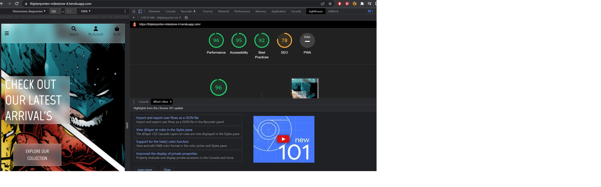
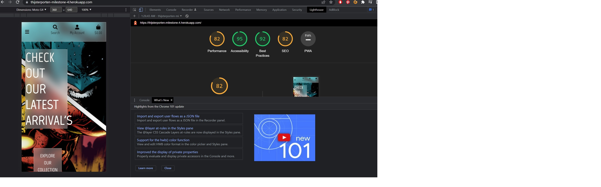

# TESTING

## HTML VERIFIER

Using w3c HTML verifier I checked all live pages deployed on heroku. There were several warnings and some errors involving stray div's and li elements. These have been removed by making use of the authenticator.
The major warning given was that the javascript at the bottom of the page doesnt require text="text/javascript". These aren't serious warnings however have been removed.

## HOMEPAGE

## ALLPRODUCTS

## FULLPRODUCT

## CATEGORY

## BAG

## CHECKOUT

## CHECKOUT SUCCESS

## CONTACT

## PROFILE

However it is worth noting when checking all HTML pages one by one as they are coded. It gives off a lot of warnings and errors. This is due to the templating language used from django.

## CSS 

The base.css file was run through the authenticator giving no errors but a couple of warnings involving use of webkit and using background colors and border colors which are them same. However after checking the elements these were on this
doesn't cause a major issue in my opinion.

## JavaScript

All JavaScript code has been run through JSHint.
This resulted in no errors given only warnings because of the use of jQuery.
All other warnings such as missing semi colons have been fixed.

### STRIPE

### QUANTITY INPUT SCRIPT

### SEARCH BAR

## PEP8

All major python files were run through Pep8 to see if any major errors were found.
I did my best to remove all errors and warnings that were given in the terminal after contacting tutor support from code institute they told me I could add this comment  # noqa: E501 at the end of a line that is to long
to remove the warning. 

Another commen warning that the terminal gives me is that a class has no ObjectsMember and several other pylint errors. These can however all be ignored after googling each of them and searching on slack.

## AUTOMATED TESTING

In future development when working on this project I would like to further expand upon testing by creating custom test cases for each Django App created.

## RESPONSIVENESS TESTING

During development I would always check making use of chrome dev tools wether I could break the UI of my site as far as breakpoints go and everything is positioned where I would want it.
At several moments I found I could break my website. These were all easily fixed though by playing around with margins and padding.

The following options where selected:

- Iphone SE as the smallest device.
- Iphone 12 Pro as a larger phone.
- Ipad Air.
- My 15.6 inch laptop screen.
- My 27 inch monitor.

I ran a lighthouse audit as well for both mobile and desktop with the following results:

### DESKTOP

### MOBILE

These weren't 'bad' but give some usefull insights on what to improve upon. Mainly SEO would be one to look at since as an e-commerce store you want to rank high in searches.
